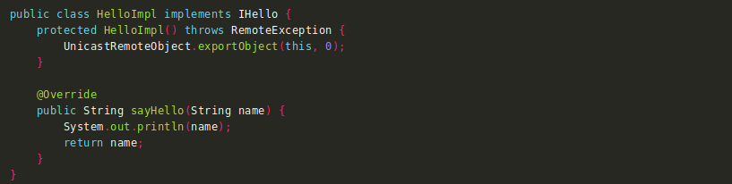
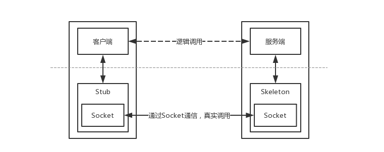
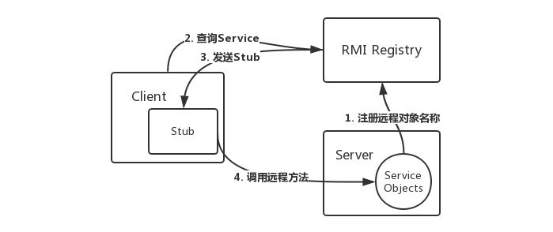

# java-demo
jndi rmi的一个demo


### 0x01 远程方法调用

以下文章来源：https://kingx.me/Exploit-Java-Deserialization-with-RMI.html

RMI全称为Remote Method Invocation(远程方法调用)，远程方法调用是分布式编程中的一个基本思想。事先远程方法调用的技术有很多，CORBA、WebService,这两种都是独立于语言实现的，但是RMI是专为java远程方法调用而设计的，其依赖的通信的协议是JRMP(Java Remote Message Protocol java远程信息交换协议)，该协议为java定制，需要服务端与客户端都有java编写。在RMI中对象是通过序列化方式传递的。


### 0x02 远程对象

使用远程方法调用，必然会涉及参数的传递和执行结果的返回。参数或者返回值可以是基本数据类型，当然也有可能是对象的引用。所以这些需要被传输的对象必须可以被序列化，这要求相应的类必须实现 java.io.Serializable 接口，并且客户端的serialVersionUID字段要与服务器端保持一致。

任何可以被远程调用方法的对象必须实现 java.rmi.Remote 接口，远程对象的实现类必须继承UnicastRemoteObject类。如果不继承UnicastRemoteObject类，则需要手工初始化远程对象，在远程对象的构造方法的调用UnicastRemoteObject.exportObject()静态方法。如下：




注: IHello是客户端和服务端共用的接口（客户端本地必须有远程对象的接口，不然无法指定要调用的方法，而且其全限定名必须与服务器上的对象完全相同），HelloImpl是一个服务端远程对象，提供了一个sayHello方法供远程调用。它没有继承UnicastRemoteObject类或者实现java.rmi.Remote接口，而是在构造方法中调用了UnicastRemoteObject.exportObject()。

在JVM之间通信时，RMI对远程对象和非远程对象的处理方式是不一样的，它并没有直接把远程对象复制一份传递给客户端，而是传递了一个远程对象的Stub，Stub基本上相当于是远程对象的引用或者代理。Stub对开发者是透明的，客户端可以像调用本地方法一样直接通过它来调用远程方法。Stub中包含了远程对象的定位信息，如Socket端口、服务端主机地址等等，并实现了远程调用过程中具体的底层网络通信细节，所以RMI远程调用逻辑是这样的：



从逻辑上来看，数据是在Client和Server之间横向流动的，但是实际上是从Client到Stub，然后从Skeleton到Server这样纵向流动的。

- Server端监听一个端口，这个端口是JVM随机选择的；
- Client端并不知道Server远程对象的通信地址和端口，但是Stub中包含了这些信息，并封装了底层网络操作；
- Client端可以调用Stub上的方法；
- Stub连接到Server端监听的通信端口并提交参数；
- 远程Server端上执行具体的方法，并返回结果给Stub；
- Stub返回执行结果给Client端，从Client看来就好像是Stub在本地执行了这个方法一样；

那怎么获取Stub呢？

### RMI注册表

Stub的获取方式有很多，常见的方法是调用某个远程服务上的方法，向远程服务获取存根。但是调用远程方法又必须先有远程对象的Stub，所以这里有个死循环问题。JDK提供了一个RMI注册表（RMIRegistry）来解决这个问题。RMIRegistry也是一个远程对象，默认监听在传说中的1099端口上，可以使用代码启动RMIRegistry，也可以使用rmiregistry命令。

要注册远程对象，需要RMI URL和一个远程对象的引用。

```java
IHello rhello = new HelloImpl();
LocateRegistry.createRegistry(1099);
Naming.bind("rmi://0.0.0.0:1099/hello", rhello);
```

LocateRegistry.getRegistry()会使用给定的主机和端口等信息本地创建一个Stub对象作为Registry远程对象的代理，从而启动整个远程调用逻辑。服务端应用程序可以向RMI注册表中注册远程对象，然后客户端向RMI注册表查询某个远程对象名称，来获取该远程对象的Stub。

```java
Registry registry = LocateRegistry.getRegistry("kingx_kali_host",1099);
IHello rhello = (IHello) registry.lookup("hello");
rhello.sayHello("test");

```

> 注：说白了，上面这两个东西就是一组代理

使用RMI Registry之后，RMI的调用关系是这样的：



所以其实从客户端角度看，服务端应用是有两个端口的，一个是RMI Registry端口（默认为1099），另一个是远程对象的通信端口（随机分配的）。这个通信细节比较重要，真实利用过程中可能会在这里遇到一些坑。


